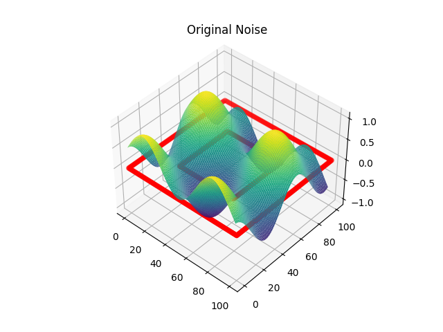
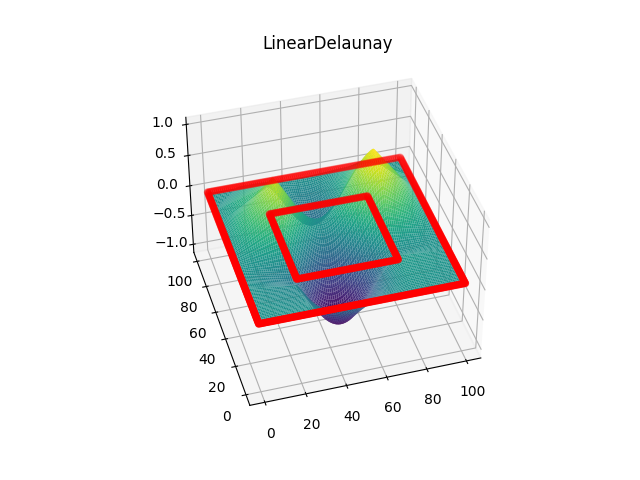
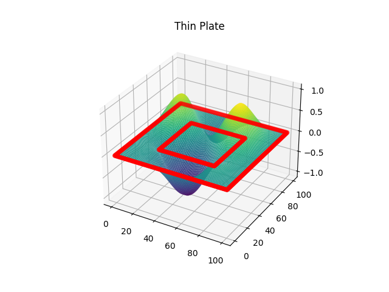
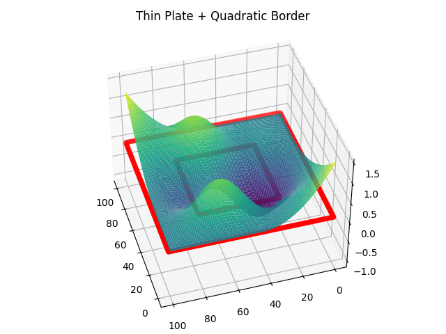

# Project ExtrapoleTopo

## Overview

This project is a C++ program that demonstrates the "extrapolation" of 2D data points using different interpolation methods and visualizes the results. It also includes the generation of custom noise data and the addition of a quadratic border effect to the interpolated data.

## Dependencies

Before running the project, ensure you have the following dependencies installed:

- C++ compiler (e.g., g++)
- Eigen library (for linear algebra operations)
- matplotlibcpp library (for plotting)

You can install the Eigen library using the package manager of your choice (e.g., `apt`, `brew`, or manually downloading it). You can also install the matplotlibcpp library by following its installation instructions.

## Project Structure

The project consists of the following files:

- `Main.cpp`: The main program that performs interpolation, generates data, and visualizes the results. 
- `MiscellaneousFunction.hpp`: Header file containing various functions and data structures used in the project.
- `CMakeLists.txt`: A CMake configuration file for building the project.

## How to Build

To build the project, follow these steps:

1. Make sure you have installed the required dependencies mentioned above.

2. Navigate to the project directory in your terminal.

3. Create a build directory:

   ```bash
   mkdir build
   cd build

## Interpolation Methods

The program demonstrates two interpolation methods:

- Thin Plate Spline Interpolation
- Linear Delaunay Triangle Interpolation

These methods are applied to the generated data points and visualized using 3D plots.

## Custom Noise Generation

The project includes a custom noise function defined in MiscellaneousFunction.hpp. You can adjust the frequency and amplitude of the noise pattern by modifying the customNoise function.

## Quadratic Border Effect

A quadratic border effect is added to the interpolated data points in the direction specified by flow_dir, this parameter can be modify as desired. The intensity of this effect depends on the maxExtentionCoeff parameter, and it is applied to points outside the known domain valley.

## Visualization

The program uses matplotlibcpp to create 3D plots of the original noise, interpolated data using Thin Plate Spline, interpolated data using Linear Delaunay Triangle, and interpolated data with the quadratic border effect.


| Image 1 | Image 2 |
|---------|---------|
|  |  |

| Image 3 | Image 4 |
|---------|---------|
|  |  |


